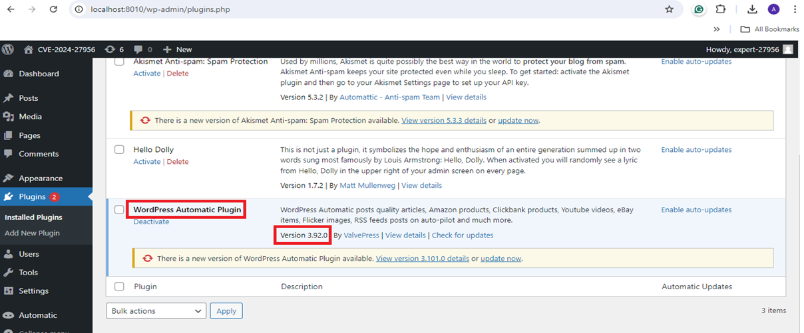

## **Overview:**
 
An OpenAI LLM-based agent tool for automatically generating Python exploits by CVE-ID as part of a penetration testing automation activity:
-	The tool will generate a Python exploit based on the CVE-ID entered
-	Run the exploit against a target chosen 
-	In the near future: generate a report for the pen testing.
-	The tool is built using OpenAI Azure Assistant API, But you can change the creation and the initialization part for OpenAI Assistant API
Check these two links for the tweaks and differences between the two:

[Assistants quickstart - OpenAI API](https://platform.openai.com/docs/assistants/quickstart) 

[How to create Assistants with Azure OpenAI Service - Azure OpenAI | Microsoft Learn ](https://learn.microsoft.com/en-us/azure/ai-services/openai/how-to/assistant)  

**To run the program:** 
-	git clone https://github.com/amessedad/autoexploitGPT
-	cd repo-name e.g: cd autoexploitGPT
-	pip install -r requirements.txt 
-	The libraries in the requirements.txt file are: openai, requests, python-dotenv
In the .env the environment file, put your generated API keys depending on the API used, OpenAI Azure assistant API, or the OpenAI assistant API 

- Currently, this tool is not under the MIT License, We Apologize for this.

**Testing Environment:**
Before using the tool, make sure the Docker containers are up.
Use the Docker files provided in the Docker folder, they contain needed files to replicate the vulnerabilities described in their respective CVEs :
-  CVE-2021-41773, and CVE-2021-42013 (Apache Servers), need only running the Docker image using docker-compose up -d –build command, then you use the Tool (python main.py, or python3 main.py)
- For CVE-2024-27956, and CVE-2024-5084 are both WordPress plugin Vulnerabilities, after installing WordPress make sure the plugins provided in the folders are installed and activated Figure 1, the Tool failed in generating successful exploits for both CVEs, find their PoC in this Links:
PoC : CVE-2024-27956 : diego-tella Github repository
PoC: CVE - 2024-5084: WOOOOONG  GitHub repository
 
**Figure 1 :** example of activated vulnerable WordPress plugin 
-  For CVE-2020-7246 Qdpm 9.1 is a Project management Web-based application, everything is set, and the type of attack is authenticated, use these credentials: 
 user : abderrezzaq@gmail.com  PSW: admin123456789
   - Our tool did not work for this CVE too, use PoC to understand the attack and the difference between the exploit generated between our LLM-based tool and the PoC 
PoC : CVE-2020-7246:  exploit-db portal under EDB-ID: 50944

 <b>Figure 1</b>b> 

 **Troubleshooting :**

- **Environment Variables Not Loading**: Ensure that the `.env` file is correctly placed in the same directory as `main.py`. Also, ensure the keys and values are correctly formatted without extra space.

- **Missing Packages**: If you encounter errors related to missing modules, install them using pip as shown in the installation section.

- **API Key Errors**: Ensure that your API keys are valid and have the necessary permissions.

**License:**

This program version is not licensed under the MIT License. 

**Acknowledgements:**

- Azure OpenAI
- National Vulnerability Database (NVD)

 

